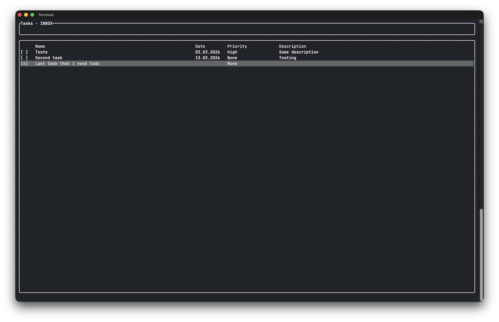
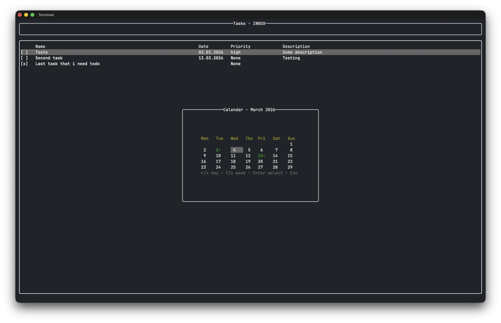
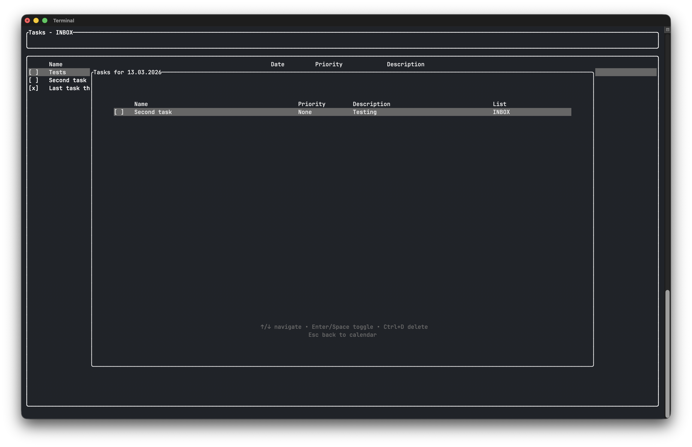
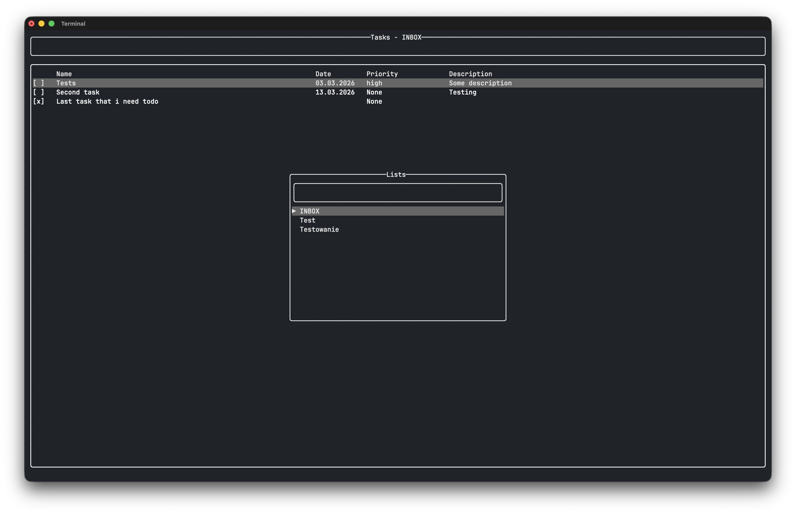

# todoCLI - Terminal Task Manager


todoCLI is an advanced task manager that runs in the terminal, written in Rust. It allows efficient task management with support for priorities, dates, calendar view, and multiple folders. TodoCLI works with Markdown files and folders as tasks and task lists, allowing you to easily edit, move, and delete tasks from within the file system.

## Features

- Create, edit, and delete tasks
- Organize tasks in folders
- Calendar view with tasks
- "Today" and "Next 7 days" filters
- Task priorities (High, Medium, Low)
- Task descriptions
- Check off completed tasks
- Colorful terminal interface
- Intuitive keyboard shortcuts
- Configuration via TOML file

## Installation

### From source code

```bash
git clone https://github.com/xspislax/todo-cli.git
cd todo-cli
cargo install --path .
```

## Configuration

Currently, you can only configure the data path and default folder in the toml file in the `~/.config/todoCLI/config.toml` path. The `default_folder` will be created inside `data_path`
Example config file:

```toml
[features]
data_path = "/Users/xavierspisla/Documents/todo_files"
default_folder = "INBOX"
```

## Keyboard shortcuts

- `ctrl + l` to open and add task lists
- `ctrl + v` to open calendars view
- `ctrl + c` to move task/file to other directory
- `ctrl + f` to open .md file in default markdown editor app on your system
- `ctrl + d` to delete file or directory (except the `default_folder` directory)
- `right arrow` key opens the file preview
- `arrows` used for navigation

## Dynamic input

- The “!” symbol with the letters high, medium, and low adds priority to a task. There are two ways to add priority: using the full name `!high` or the first letter of the priority `!h`. Other options are medium (m) and low (l). If priority is not used, it is set to None by default.
- The “@” symbol allows you to add a date. There are three ways to do this. The first is to write `@today` or `@tomorrow`. Another way is to write the day of the week in lowercase, e.g., `@monday`, and the task will be added for the coming Monday. Dates can also be added by counting the number of days from today, e.g., `@5` (in five days), or in the classic format d.m.y `@01.01.2026`.
- The “.” character adds a description, e.g. `.Example description`

### Example of a complete task addition

#### `Task name !h @today .Example description`

## How file looks

```md
# Example task

Checked: false

Date: 13.04.2026

Description: Some description

Priority: high
```

## Screenshots

Photos of some features


_Main interface showing task list_


_Calendar view with tasks_


_Tasks in after entering calendar_


_Directory as lists_

### Disclaimer

This application has only been tested on macOS Tahoe.
